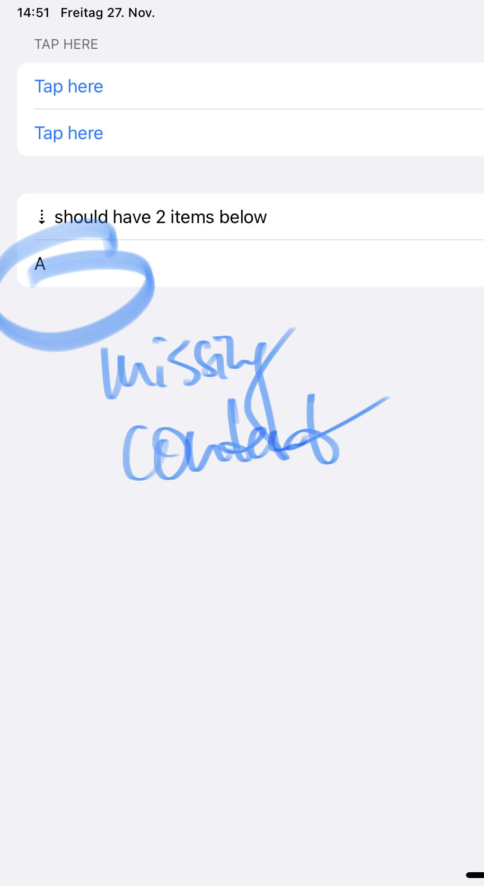

# FB8919326: List in Form not updated correctly when state is changed during an animation

The attached example ContentView reproduces a SwiftUI bug where, when state is changed parallel to an animation, List content inside a form is not updated correctly on iOS/iPadOS 14.2

To reproduce: Run the example project / view, press "Tap here". The 2nd list should display two items, but instead only one is shown.

Example code is also available here:
https://github.com/ralfebert/SwiftUIListItemsUpdateDuringAnimationBug

